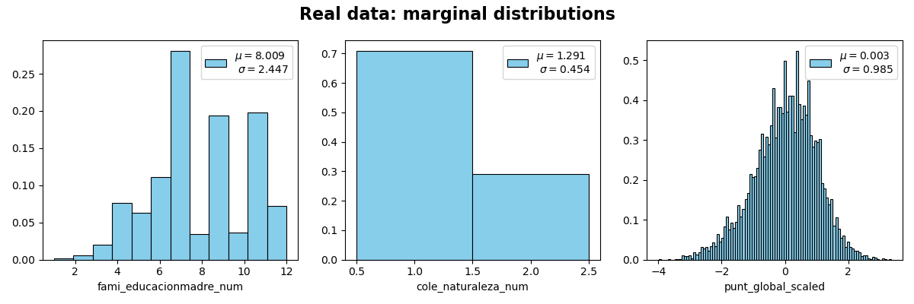
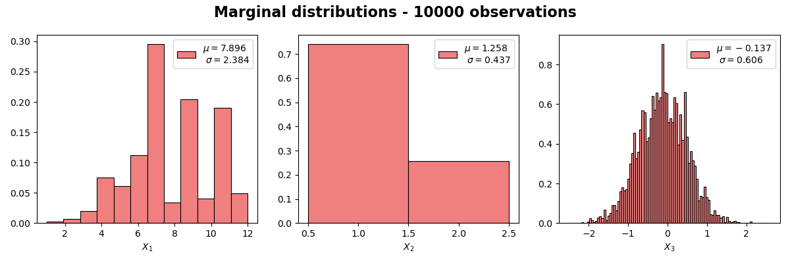
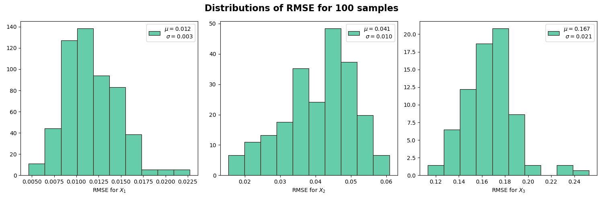

# A mixed graphical model sampler

In this project, a random sampler of a mixed graphical model (mgm) is implemented through the Metropolis algorithm. In particular, it supports a mgm with $m-1$ categorical variables and $1$ Gaussian variable. To train the model, the R library mgm ([Haslbeck, & Waldorp, 2020](https://arxiv.org/abs/1510.06871)) was used, a sample of $8405$ admitted to the University of Antioquia and $3$ variables for characterizing these Colombian high school graduates. This sampler is used to validate this type of mgm's.

## Overview

The accepted mgm in this project is of the form

$$
p_{\theta}(x_1,\ldots, x_{m-1}, y) \propto \exp{\left\lbrace \sum_{s\in V}\alpha_s(x_s) + \sum_{(s,t)\in E}\alpha_{st}(x_s, x_t) + \sum_{s\in V}\gamma_s(x_s)y + \gamma^{\prime}_s(x_s)y^2  \right\rbrace }
$$

where $(x_1,\ldots,x_{m-1},y)$ is a realization of the random vector $X=(X_1,\ldots,X_{m-1},X_m=Y)$ with $m-1$ categorical variables and one Gaussian variable $Y$; $G=(V, E)$ is a graph in which nodes $s\in V$ represent the variables of the dataset, and edges $E$ represent pairwise conditional associations between variables, while conditioning in the remaining variables. This exponential representation is obtained by maximizing Shannon entropy ([Wainwright, & Jordan, 2008](https://people.eecs.berkeley.edu/~wainwrig/Papers/WaiJor08_FTML.pdf)).   

The model parameters $\theta=(\alpha, \gamma, \gamma^{\prime})$ are obtained with the help of the R package mgm and are used as inputs in this project. It has been used a sample of $8405$ admitted to the University of Antioquia and $3$ variables for characterizing these Colombian high school graduates: "fami_educacionmadre_num", "cole_naturaleza_num" and "punt_global_num". Below the marginal distributions of these variables.

To generate random observations according to $p_{\theta}(x_1,\ldots, x_{m-1}, y)$ it has been used the Metropolis algorithm with a symmetric proposal distribution, i.e. with acceptance probability 

$$
A = \min \bigg( 1, \frac{p_{\theta}(x_1^{\ast},\ldots,x_{m-1}^{\ast}, y^{\ast})}{p_{\theta}(x_1,\ldots,x_{m-1}, y)} \bigg).
$$

Below the marginal distributions of a sample of $10000$ colombian high school graduates randomly generated.

## Purpose

The mgm sampler will be used as a tool in model validation. Root mean square error (RMSE) has been used to compare the values of histograms bins generated from the mgm sampler and the corresponding values from the real data. Below the distributions of RMSE associated with each random variable after having generated $100$ samples. In our example, the model exhibits an acceptable performance. Despite the model seems to behave well with respect to the categorical variables, the error in the Gaussian variable is too big.

